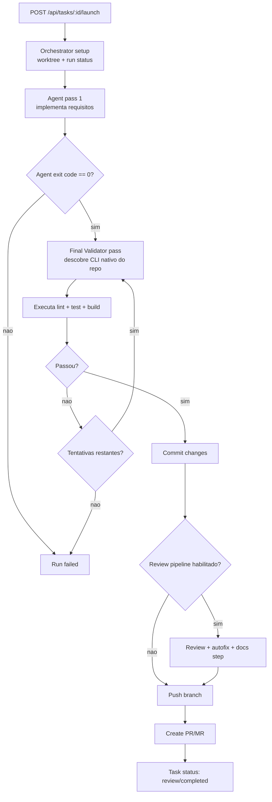

# 🚀 Vibe-Code

## Operator Note

- Cluster-safe defaults: VIBE_CODE_MAX_AGENTS=1, VIBE_CODE_INACTIVITY_MS=1200000, 3Gi memory.
- Terminal session workflow lives in WORKFLOW.md.


> **Autonomous Code Production Control Plane** — Orquestra agentes de código IA (Claude Code, Aider, OpenCode) para transformar objetivos em mudanças validadas, evidências operacionais e handoffs previsíveis entre múltiplos repositórios Git.

[](https://www.typescriptlang.org/)
[](https://bun.sh/)
[](https://react.dev/)
[](https://hono.dev/)
[](https://www.sqlite.org/)
[](./LICENSE)
[](https://vibe.antonio-code.duckdns.org/health)

---

## ✨ O que é Vibe-Code?

**Vibe-Code** está evoluindo de um task manager assistido para um control plane de produção autônoma de código. O board e os painéis operacionais continuam existindo, mas deixam de ser a identidade principal do produto: o foco passa a ser objetivo, execução, validação, review, artefatos e memória.

Hoje o runtime já consegue orquestrar execuções, reviews e PRs. A direção do repositório a partir desta fase é endurecer contratos, quality gates e contexto para que o sistema consiga assumir mais trabalho útil sem babysitting constante.

Use agentes como Claude Code, Aider ou OpenCode para:

- 🎯 **Objetivos Executáveis** — Transforme objetivos em tarefas, milestones, reviews e artifacts auditáveis
- 🤖 **Automatização Inteligente** — Execute code generation, refactoring, bug fixing e docs com loops de review
- 🔄 **Multi-Repo** — Trabalhe em vários repositórios simultaneamente
- 📊 **Control Plane Operacional** — Acompanhe runtime, filas, inbox, approvals e logs em tempo real
- 🔐 **Isolamento Git** — Cada tarefa roda em seu próprio git worktree (sem contaminar branches)
- ✅ **Pipeline de Qualidade** — Review automático, commit, push, PR e evidências de validação
- 🎛️ **Engines Plugáveis** — Adicione novos agentes IA facilmente

---

## 🧭 Contratos do Repositório

O repositório agora tem uma camada explícita de contratos para humanos e agentes. A intenção é que comportamento operacional e critérios de qualidade fiquem versionados dentro do próprio repo, em vez de espalhados em prompts ad hoc.

| Artefato | Papel |
|---|---|
| `AGENTS.md` | Índice curto para navegação e regras obrigatórias |
| `WORKFLOW.md` | Contrato de workflow em modo compatível com a stack atual |
| `docs/index.md` | Mapa da documentação operacional |
| `docs/repo-contract.md` | Contrato do repositório: quality gates, boundaries e rollout |
| `docs/glossary.md` | Vocabulário comum para objetivos, runs, artifacts e memória |

Nesta release, `WORKFLOW.md` ainda convive com prompts e templates existentes. Ele serve como contrato-alvo para a migração do runtime, sem quebrar o pipeline atual.

---

## 🔁 Recursos extraídos do Multica

Esta versão incorporou recursos do projeto `multica` de forma adaptada ao stack do Vibe-Code. A extração não copia a arquitetura Next.js/Go do Multica; ela traz os conceitos que encaixam no runtime Bun/Hono/React atual.

| Recurso do Multica | Como entrou no Vibe-Code | Onde usar |
|---|---|---|
| **Runtimes gerenciados** | Novo endpoint `/api/runtimes` com visão do compute local, capacidade, engines disponíveis, workload e saúde operacional | Botão **Runtimes** na sidebar ou `Ctrl/Cmd+K` → `Runtimes` |
| **Unified runtimes** | Os engines locais agora aparecem como parte de um runtime único, com slots ativos e limite configurado por `VIBE_CODE_MAX_AGENTS` | Painel **Runtimes** |
| **Agentes como teammates** | O Vibe-Code já mantinha tarefas, execuções e engines; a extração organiza isso como capacidade operacional do runtime | Painéis **Engines**, **Runtimes** e board |
| **Sinais de saúde** | Status `healthy`, `degraded` ou `saturated` calculado por disponibilidade de engines, falhas e uso de capacidade | `/api/runtimes` e painel **Runtimes** |
| **Inbox operacional** | Novo endpoint `/api/inbox` com alertas derivados de falhas, reviews, execuções ativas, engines ausentes e runtime saturado | Botão **Inbox** na sidebar ou `Ctrl/Cmd+K` → `Inbox` |

### Painel Runtimes

O painel **Runtimes** mostra:

- host local, plataforma, CPUs, uptime e diretório de dados;
- capacidade atual: agentes ativos vs. `VIBE_CODE_MAX_AGENTS`;
- quantidade de engines disponíveis vs. cadastrados;
- workload acumulado: tarefas, execuções, falhas e última execução;
- lista de engines online/ausentes e execuções ativas por engine.

API:

```bash
GET /api/runtimes
```

Exemplo de resposta:

```json
{
  "data": [
    {
      "id": "host-win32",
      "name": "host",
      "kind": "local",
      "status": "healthy",
      "capacity": {
        "activeAgents": 1,
        "maxAgents": 4,
        "availableEngines": 3,
        "totalEngines": 5
      }
    }
  ]
}
```

### Inbox operacional

O **Inbox** é uma caixa de entrada operacional derivada do estado real do Vibe-Code. Ele não cria uma nova tabela: os itens são calculados a partir de `tasks`, `agent_runs`, engines disponíveis e capacidade do runtime.

Ele mostra:

- tarefas com falha que precisam de retry ou investigação;
- tarefas em review com PR pronto;
- tarefas em execução;
- engines configurados mas indisponíveis no runtime local;
- saturação quando todos os slots de agentes estão ocupados.

API:

```bash
GET /api/inbox
```

---

## 🎯 Casos de Uso

| Use Case | Descrição |
|----------|-----------|
| **Geração de Código** | Criar features novas automaticamente em múltiplos repos |
| **Refactoring em Massa** | Atualizar padrões de código simultaneamente |
| **Bug Fixes** | Resolver issues usando agentes de IA |
| **Documentação** | Gerar ou atualizar docs, READMEs automaticamente |
| **CI/CD Customizado** | Orquestrar workflows complexos com controle fino |
| **Code Review Automático** | Pipeline de review com múltiplas personas (frontend, backend, security, quality, docs) |
| **Operação Noturna** | Deixar objetivos, validações e handoffs rodando com supervisão mínima |

---

## 📦 Stack Técnico

```
vibe-code (Bun Monorepo)
├── packages/shared/        (TypeScript types kompartilhados)
├── packages/server/        (Hono + Bun + SQLite)
└── packages/web/           (React 19 + Vite + Tailwind CSS 4)
```

**Backend:**
- 🦀 **Bun** — Runtime JavaScript/TypeScript ultrarrápido
- 🌐 **Hono** — Web framework minimalista e rápido
- 📚 **SQLite** — Persistência local (WAL mode)
- 🔌 **WebSocket** — Streaming em tempo real de logs
- 🛠️ **Zod** — Validação de tipos em runtime

**Frontend:**
- ⚛️ **React 19** — UI moderna com Server Components
- 🎨 **Tailwind CSS 4** — Estilização rápida e responsiva
- ⚡ **Vite** — Dev server ultrarrápido com HMR
- 🎭 **dnd-kit** — Drag-and-drop sem dependências pesadas
- 🎪 **Radix UI** — Componentes acessíveis sem estilos

---

## 🏗️ Arquitetura

### Data Flow

```
┌─────────────────────────────────────────────────────────────────┐
│                         Frontend (Web)                           │
│  ┌──────────────────┐  ┌──────────────────┐                     │
│  │   Kanban Board   │  │   Task Detail    │                     │
│  │  (drag-and-drop) │  │  (live logs)     │                     │
│  └────────┬─────────┘  └────────┬─────────┘                     │
│           │                     │                                │
│           └──────────┬──────────┘                                │
│                      │                                           │
│              ┌───────▼─────────┐                                │
│              │   WebSocket     │                                │
│              │   Client        │                                │
│              └────────┬────────┘                                │
└───────────────────────┼───────────────────────────────────────┘
                        │
          ┌─────────────┼─────────────┐
          │             │             │
    ┌─────▼──────┐ ┌───▼────────┐ ┌──▼──────────────┐
    │ REST API   │ │ WebSocket  │ │ Event Stream   │
    │   (Hono)   │ │   Hub      │ │   (AsyncGen)   │
    └────┬───────┘ └───┬────────┘ └──┬──────────────┘
         │             │             │
         └─────────────┼─────────────┘
                       │
┌──────────────────────▼─────────────────────────────────────────┐
│                    Backend (Server)                             │
│                                                                 │
│  ┌────────────────────────────────────────────────────────┐   │
│  │          Orchestrator (Task Lifecycle)                 │   │
│  │  • Concurrent run management (max 4)                   │   │
│  │  • Git worktree creation/cleanup                       │   │
│  │  • Engine spawning & process management               │   │
│  └────────────────────────────────────────────────────────┘   │
│                                                                 │
│  ┌──────────────┐  ┌──────────────┐  ┌──────────────┐         │
│  │  Claude Code │  │    Aider     │  │   OpenCode   │         │
│  │    Engine    │  │    Engine    │  │    Engine    │         │
│  │ (CLI spawn)  │  │ (CLI spawn)  │  │ (CLI spawn)  │         │
│  └──────────────┘  └──────────────┘  └──────────────┘         │
│                                                                 │
│  ┌────────────────────────────────────────────────────────┐   │
│  │   Git Service + Worktree Manager                       │   │
│  │   • Bare clone @ ~/.vibe-code/repos/                   │   │
│  │   • Worktree @ ~/.vibe-code/workspaces/               │   │
│  └────────────────────────────────────────────────────────┘   │
│                                                                 │
│  ┌────────────────────────────────────────────────────────┐   │
│  │   SQLite Database                                       │   │
│  │   • tasks, agent_runs, agent_logs                      │   │
│  │   • repositories, schedules                            │   │
│  │   • WAL mode + Foreign Keys enabled                    │   │
│  └────────────────────────────────────────────────────────┘   │
└─────────────────────────────────────────────────────────────┐
```

### Fluxo de Execução (Task Launch)

```
User clicks "Launch Task"
         │
         ▼
┌──────────────────────────────┐
│ POST /api/tasks/{id}/launch  │
│ (with engine/model override) │
└──────────┬───────────────────┘
           │
           ▼
┌──────────────────────────────┐
│ Orchestrator.launch()        │
│ • Validate engine available  │
│ • Create run record (DB)     │
│ • Create git worktree        │
│ • Spawn agent process        │
│ • Set up activity monitoring │
└──────────┬───────────────────┘
           │
           ▼
     ┌─────────────────────┐
     │  AsyncGenerator     │
     │  events streaming   │
     │  • logs (stdout)    │
     │  • errors (stderr)  │
     │  • status updates   │
     └──────┬──────────────┘
            │
            ├──▶ DB persist (logs table)
            │
            ├──▶ WebSocket broadcast
            │
            └──▶ Activity timestamp update
                (for stall detection)
```

### Fluxo de Orquestração (Mermaid)



---

## 🚀 Quick Start

### Pré-requisitos

- **Bun** 1.3+ ([instalar](https://bun.sh/))
- **Git** 2.20+
- **Node.js** 18+ (se você não usa Bun nativamente)
- **Git Bash ou WSL no Windows** para `bun run dev`, porque o script raiz usa `bash ./scripts/dev-safe.sh`
- **Um ou mais engines IA instalados:**
  - [Claude Code](https://www.anthropic.com/claude-code) — `claude` CLI
  - [Aider](https://aider.chat/) — `aider` CLI
  - [OpenCode](https://opencode.ai) — `opencode` CLI

### 1️⃣ Instalação

```bash
# Clone o repositório
git clone https://github.com/seu-usuario/vibe-code.git
cd vibe-code

# Instale dependências (Bun)
bun install

# Build para garantir que tudo compila
bun run build

# Type check
bun run typecheck
```

### 2️⃣ Inicie o Servidor

```bash
# Ambos server e web (recomendado)
bun run dev

# Apenas o servidor/API (sem frontend dev)
bun run dev:server

# Apenas o Vite frontend dev server
bun run dev:web
```

**Saída esperada:**
```
$ bun run dev

@vibe-code/server dev
 ▶ http://localhost:3000   HTTP
 ▶ http://localhost:3000/ws  WebSocket

@vibe-code/web dev
 ▶ http://localhost:5173   Local

Press h to show help
```

### 3️⃣ Acesse a Interface Web

Abra seu navegador em **http://localhost:3000**

No desenvolvimento local, `3000` é a entrada única do sistema:
- `/` renderiza o frontend via Vite, usando `VITE_DEV_URL`.
- `/api/*` é a API do backend.
- `/ws` é o WebSocket da aplicação.

O endereço `http://localhost:5173` é apenas o servidor interno do Vite. Use-o só para depurar o frontend isoladamente.

Para GitHub OAuth local, use a mesma origem canônica:
- `VIBE_CODE_PUBLIC_URL=http://localhost:3000`
- GitHub OAuth callback: `http://localhost:3000/api/auth/github/callback`

Em produção, a mesma regra vale com o domínio público: abra o sistema pelo domínio definido em `VIBE_CODE_PUBLIC_URL`, e cadastre o callback `<VIBE_CODE_PUBLIC_URL>/api/auth/github/callback`.

Você verá:
- 📋 **Board View** — Uma visão operacional do pipeline (não a única superfície do produto)
- 🔧 **Sidebar** — Seletor de repositórios
- ⚙️ **Engine Status** (canto superior direito) — Mostra engines disponíveis
- 📡 **Painéis Operacionais** — Runtimes, inbox, schedules, engines e evidências por tarefa

### 4️⃣ Configure seu Primeiro Repositório

1. Clique **"+ Add Repository"** (ou botão similar)
2. **URL do Git**: Paste uma URL de repositório GitHub/GitLab
3. **Default Branch**: Geralmente `main` ou `master`
4. Clique **"Add"**

O repositório será clonado como **bare clone** em `~/.vibe-code/repos/`

### 5️⃣ Crie uma Task

1. Selecione o repositório no sidebar
2. Clique **"+ New Task"**
3. **Title**: Descrição breve (ex: "Fix login bug")
4. **Description**: Detalhes (ex: "User cannot login with special chars in password")
5. Selecione **Engine** (Claude Code, Aider, OpenCode)
6. Clique **"Create"** — task vai para "Backlog"

### 6️⃣ Lance a Task

1. Clique no card da task
2. No painel de detalhes, clique **"Launch"** (ou arraste para "In Progress")
3. Acompanhe os **logs em tempo real** na aba "Output"
4. Agent vai:
  - ✅ Criar uma branch `vibe-code/{id}/{title}`
  - 🧪 Rodar validador final no CLI do agente (lint, test, build), com retentativas automáticas
  - 🔧 Fazer commits com suas mudanças
  - 📊 Passar pelo pipeline de review (se habilitado)
  - 📝 Executar etapa final de docs (gera `docs/tasks/<task-id>.md` e atualiza README/AGENTS quando necessário)
  - 📤 Push para origin e criar PR
5. Task mostra status: **In Progress** → **Review** → **Done**

### 🐳 Rodando em Container

A imagem oficial inclui Bun, git, Claude Code CLI e OpenCode CLI prontos para uso. Skills (em `~/.agents`) **não** são embutidas na imagem — monte um volume nesse caminho e popule-o externamente conforme sua necessidade.

```bash
# Build local
docker build -t vibe-code:local .

# Run
docker run --rm \
  -p 3000:3000 \
  -e ANTHROPIC_API_KEY=sk-ant-... \
  -v vibe-code-data:/data \
  -v vibe-code-skills:/home/vibe/.agents \
  vibe-code:local
```

**Contrato do container:**

| Item | Valor |
| --- | --- |
| Porta HTTP/WS | `3000` (`/api/*`, `/ws`) |
| Healthcheck | `GET /api/health` |
| User | `vibe` (uid 1000) |
| Volume — dados | `/data` (SQLite, repos bare, worktrees) |
| Volume — skills | `/home/vibe/.agents` |
| Env obrigatória | `ANTHROPIC_API_KEY` (ou outras keys conforme engine) |
| Env opcionais | `PORT`, `VIBE_CODE_MAX_AGENTS`, `LITELLM_BASE_URL`, `LITELLM_MASTER_KEY`, `VIBE_CODE_PUBLIC_URL` |

---

## 🔧 Configuração Avançada

### Variáveis de Ambiente

```bash
# Arquivo: .env (crie na raiz)

# Backend
PORT=3000                                      # (default: 3000)
VIBE_CODE_DATA_DIR=~/.vibe-code              # (default: ~/.vibe-code)
VIBE_CODE_MAX_AGENTS=4                        # Max concurrent runs
VIBE_CODE_AGENT_TIMEOUT_MS=7200000            # 2h timeout (default: 2h)
VIBE_CODE_FINAL_VALIDATOR_MAX_ATTEMPTS=3      # Tentativas do validador final (lint/test/build)
VIBE_CODE_REVIEW_ENABLED=true                 # Enable review pipeline
VIBE_CODE_REVIEW_STRICT=false                 # Block PR on review failures
VIBE_CODE_REVIEW_AUTO_APPLY=true              # Apply frontend/backend/security/quality suggestions
VIBE_CODE_DOCS_AUTO_APPLY=true                # Run docs finisher step before PR creation
VIBE_CODE_PUBLIC_URL=https://vibe.example.com # URL pública para links em notificações externas

# GitHub (Para criar PRs automaticamente)
GITHUB_TOKEN=ghp_xxxxx...                     # (required para PRs)

# OpenCode (se usar esse engine)
OPENCODE_API_KEY=sk_xxxx...                   # (optional)

# Telegram (notificações de conclusão de tasks)
# Configure via Settings na UI ou via variáveis abaixo
# TELEGRAM_BOT_TOKEN=...
# TELEGRAM_CHAT_ID=...
```

### Estrutura de Configuração Local

```
~/.vibe-code/
├── db.sqlite                                  # Database SQLite
├── repos/                                     # Bare clones
│   ├── my-repo.git/
│   ├── another-repo.git/
│   └── ...
├── workspaces/                                # Git worktrees por task
│   ├── {task-id}/
│   │   ├── .git (worktree)
│   │   └── (código do repositório)
│   └── ...
└── (logs)
```

### Engines Disponíveis

#### Claude Code
```bash
# Instale Claude Code
# Download: https://www.anthropic.com/claude-code

# Ou via Homebrew (macOS)
# brew install claude-code

# Verificar
claude --version
```

**Features:**
- ✅ Suporte completo a tools (file read/write, bash, git, etc)
- ✅ Modelo mais poderoso (Claude 3.5 Sonnet)
- ✅ stdin aberto para interatividade
- ✅ Excelente para tasks complexas

#### Aider
```bash
# Instale via pip
pip install aider-chat

# Ou condaonda update
conda install -c conda-forge aider

# Verificar
aider --version
```

**Features:**
- ✅ Especial para pair programming
- ✅ Suporta múltiplos LLMs (anthropic, openai, etc)
- ✅ Diff-based editing
- ✅ Leve e rápido

#### OpenCode
```bash
# Instale via npm
npm install -g opencode-ai

# Verificar
opencode --version
```

**Features:**
- ✅ JSON structured output com `opencode run --format json`
- ✅ Suporte a MCP servers (GitHub, filesystem, etc.)
- ✅ Compatível com LiteLLM (roteamento multi-modelo)
- ✅ Configuração via `opencode.json` por workspace

**Comportamento no Vibe-Code:**
- PRs são criados automaticamente pela plataforma após o commit — `github_create_pull_request` é bloqueado no `opencode.json` gerado
- `todowrite` também é bloqueado (bug de schema com modelos que serializam arrays como string)
- Configuração injetada em `opencode.json` temporário por run, incluindo MCP GitHub com o token configurado

### 🔔 Notificações Telegram

O Vibe-Code envia notificações Telegram ao completar tasks. Configure via **Settings** na UI:

| Campo | Descrição |
|-------|-----------|
| **Bot Token** | Token do bot Telegram (`@BotFather`) |
| **Chat ID** | ID do canal ou grupo (ex: `-1001234567890`) |
| **Enabled** | Ativar/desativar notificações |

Mensagens enviadas:
- `✅ Task completed with PR` — task concluiu e abriu PR (inclui link)
- `🏁 Task completed` — task concluiu sem PR
- `✅ Merge conflicts resolved!` — task de conflict-resolution concluiu

**`VIBE_CODE_PUBLIC_URL`** controla a base URL usada nos links das notificações. Configure para a URL externa acessível (ex: `https://vibe.meudominio.com`) — internamente a API ainda usa o endereço interno do cluster.

---

## 🎮 Interface Web — Guia Completo

### Kanban Board

```
┌─────────────────────────────────────────────────────────┐
│  📋 Backlog    │  ⚙️  In Progress  │  👀 Review  │  ✅ Done  │
├─────────────────────────────────────────────────────────┤
│ ┌──────────────┐ ┌──────────────┐  ┌────────────┐      │
│ │ Add new task │ │ Running task │  │ Waiting    │      │
│ │              │ │ (live logs)  │  │ for review │      │
│ └──────────────┘ └──────────────┘  └────────────┘      │
│                                                          │
│ ┌──────────────┐                                        │
│ │ Draft task   │                                        │
│ │ (ready)      │                                        │
│ └──────────────┘                                        │
└─────────────────────────────────────────────────────────┘

• Drag-and-drop entre colunas
• Clique no card para abrir painel de detalhes
• Status muda automaticamente ao lançar/completar
```

### Task Detail Panel

```
┌────────────────────────────────────────────┐
│ ✕ [Fix login validation error]             │
├────────────────────────────────────────────┤
│                                             │
│ Status: ⚙️ In Progress (2m 30s)             │
│ Engine: 🤖 Claude Code                      │
│ Branch: vibe-code/abc1def/fix-login        │
│                                             │
│ ┌──────────────────────────────────────┐  │
│ │ Description:                         │  │
│ │                                      │  │
│ │ Validate email/password on login     │  │
│ │ Add proper error messages            │  │
│ │ Support special characters           │  │
│ └──────────────────────────────────────┘  │
│                                             │
│ ┌──────────────────────────────────────┐  │
│ │ 📊 Output (Live Logs)               │  │
│ │                                      │  │
│ │ [14:45:52] Setting up workspace...  │  │
│ │ [14:46:00] Reading main.ts (284 L) │  │
│ │ [14:46:15] Thinking...               │  │
│ │ [14:46:30] ✏️ Editing src/auth.ts   │  │
│ │ [14:46:45] Running tests...          │  │
│ │ [14:47:00] ✅ Tests passed           │  │
│ │ [14:47:15] Pushing branch...         │  │
│ │ [14:47:30] 📤 PR created: #1234     │  │
│ │                                      │  │
│ │ 🔍 Search | 📋 Copy | ⊞ Fullscreen │  │
│ │                                      │  │
│ └──────────────────────────────────────┘  │
│                                             │
│ ┌──────────────────────────────────────┐  │
│ │ $ Send input to agent...             │  │
│ └──────────────────────────────────────┘  │
│                                             │
│ [Launch] [Cancel] [Retry] [Delete]        │
└────────────────────────────────────────────┘
```

Novidades operacionais do painel:

- Aba `Execution`: timeline de execução com eventos de fase, progresso e logs do agente.
- Aba `Terminal`: canal de sessão terminal para input interativo (quando habilitado por feature flag).
- Fallback legado: quando o terminal real está desabilitado, o fluxo de execução continua funcionando com o canal de logs existente.

### Atalhos de Teclado

| Atalho | Ação |
|--------|------|
| `E` | Abrir painel de engines |
| `N` | Nova task |
| `Ctrl+F` / `Cmd+F` | Buscar nos logs (quando painel aberto) |
| `Escape` | Fechar painel/modal |
| `Enter` | Enviar input para agente |

---

## 🛠️ Desenvolvimento

### Build e Test

```bash
# Type check (sem warnings)
bun run typecheck

# Lint + formatter (Biome)
bun run lint
bun run lint:fix

# Test (Vitest para web, integration tests para server)
bun run test

# Build productions
bun run build
```

### Estrutura de Diretórios

```
vibe-code/
├── packages/
│   ├── shared/
│   │   └── src/
│   │       ├── types.ts          # Task, Run, Log types
│   │       ├── api.ts            # Socket message types
│   │       └── enums.ts          # TaskStatus, etc
│   │
│   ├── server/
│   │   ├── src/
│   │   │   ├── agents/
│   │   │   │   ├── engine.ts       # AgentEngine interface
│   │   │   │   ├── registry.ts     # Engine discovery
│   │   │   │   ├── orchestrator.ts # Task lifecycle
│   │   │   │   ├── schedule-runner.ts
│   │   │   │   └── engines/        # engine adapters
│   │   │   ├── db/
│   │   │   │   ├── index.ts        # Database singleton
│   │   │   │   ├── migrations.ts
│   │   │   │   └── tables.ts
│   │   │   ├── git/
│   │   │   │   └── git-service.ts  # Worktree management
│   │   │   ├── ws/
│   │   │   │   └── broadcast.ts    # WebSocket hub
│   │   │   ├── api/
│   │   │   │   ├── repos.ts
│   │   │   │   ├── tasks.ts
│   │   │   │   ├── runs.ts
│   │   │   │   └── engines.ts
│   │   │   └── index.ts            # Entry point
│   │   └── package.json
│   │
│   └── web/
│       ├── src/
│       │   ├── components/
│       │   │   ├── Board.tsx       # Kanban board
│       │   │   ├── TaskCard.tsx
│       │   │   ├── TaskDetail.tsx  # Slide-over
│       │   │   ├── AgentOutput.tsx # Logs viewer
│       │   │   ├── Sidebar.tsx
│       │   │   ├── EnginesPanel.tsx
│       │   │   └── ...
│       │   ├── hooks/
│       │   │   ├── useTasks.ts     # Task CRUD
│       │   │   ├── useRepos.ts
│       │   │   ├── useWebSocket.ts # WS reconnection
│       │   │   └── useEngines.ts
│       │   ├── api/
│       │   │   └── client.ts       # Typed fetch wrapper
│       │   ├── App.tsx
│       │   └── index.tsx
│       └── package.json
│
├── CLAUDE.md          # Dev guide para Claude Code
├── README.md          # Este arquivo
└── package.json       # Workspace root
```

### Adicionar um Novo Engine

Use o comando `/new-engine`:

```bash
bun run new-engine my-ai-tool
```

Isso scaffolda:
- `packages/server/src/agents/engines/my-ai-tool.ts`
- Implementa `AgentEngine` interface
- Integra com o registry automaticamente

**Exemplo:**
```typescript
export class MyAIToolEngine implements AgentEngine {
  name = "my-ai-tool";
  displayName = "My AI Tool";

  async isAvailable(): Promise<boolean> {
    // Check if CLI installed
  }

  async getVersion(): Promise<string | null> {
    // Return version string
  }

  async *execute(
    prompt: string,
    workdir: string,
    options?: EngineOptions
  ): AsyncGenerator<AgentEvent> {
    // Spawn process, stream events
    yield { type: "log", stream: "stdout", content: "..." };
  }

  abort(runId: string): void {
    // Kill the process
  }

  sendInput(runId: string, input: string): boolean {
    // Send stdin to process
    return true;
  }
}
```

---

## 📊 Performance & Timeouts

### Timeouts e Limites

| Configuração | Padrão | Ambiente |
|---|---|---|
| Agent timeout | 2 horas | `VIBE_CODE_AGENT_TIMEOUT_MS` |
| Stall detection | 5 minutos de silêncio | (automático) |
| Max concurrent agents | 4 | `VIBE_CODE_MAX_AGENTS` |
| Task log buffer | 500 linhas na UI | (otimização frontend) |

### Monitoramento de Atividade

Se um agente fica sem atividade (nenhum log) por **5 minutos**, vibe-code assume que ele emperrou e aborta:

```
Activity timeline:
[14:45] API called → activity reset
[14:46] Log event → activity update
[14:47] Error event → activity update
[14:52] [STALL DETECTED] 5min de silêncio → ABORT
```

Isso evita tarefas penduradas indefinidamente. Você pode customizar:

```bash
VIBE_CODE_AGENT_TIMEOUT_MS=10800000  # 3 horas
```

---

## 🔐 Segurança

### GitHub/GitLab: rotas acessadas

As integrações com providers são somente para listar/criar repositórios e abrir/consultar PR/MR.
Não existe endpoint de deleção remota no Vibe-Code.

| Escopo | Provedor | Método | Rota/Endpoint | Finalidade |
|---|---|---|---|---|
| API interna | GitHub | GET | `/api/repos/github/list` | Listar repositórios remotos acessíveis |
| API interna | GitHub | POST | `/api/repos/github/create` | Criar repositório remoto |
| API interna | GitLab | GET | `/api/repos/gitlab/list` | Listar projetos remotos acessíveis |
| API interna | GitLab | POST | `/api/repos/gitlab/create` | Criar projeto remoto |
| API interna | GitHub | POST | `/api/settings/test/github` | Testar conexão/token do GitHub |
| API interna | GitLab | POST | `/api/settings/test/gitlab` | Testar conexão/token do GitLab |
| API externa | GitHub | GET | `https://api.github.com/user` | Obter usuário autenticado |
| API externa | GitHub | GET | `https://api.github.com/user/repos` | Listar repositórios do usuário |
| API externa | GitHub | POST | `https://api.github.com/user/repos` | Criar repositório |
| API externa | GitHub | POST | `https://api.github.com/repos/{owner}/{repo}/pulls` | Criar pull request |
| API externa | GitHub | GET | `https://api.github.com/repos/{owner}/{repo}/pulls/{number}` | Verificar status de merge do PR |
| API externa | GitLab | GET | `{gitlab_base_url}/api/v4/user` | Obter usuário autenticado |
| API externa | GitLab | GET | `{gitlab_base_url}/api/v4/projects` | Listar projetos acessíveis |
| API externa | GitLab | POST | `{gitlab_base_url}/api/v4/projects` | Criar projeto |
| API externa | GitLab | POST | `{gitlab_base_url}/api/v4/projects/{project}/merge_requests` | Criar merge request |
| API externa | GitLab | GET | `{gitlab_base_url}/api/v4/projects/{project}/merge_requests/{iid}` | Verificar status de merge do MR |

### Isolamento de Tarefas

Cada tarefa:
- ✅ Roda em seu próprio **git worktree** isolado
- ✅ Tem seu próprio **diretório de work**
- ✅ Não compartilha stdin/stdout com outras tasks
- ✅ É **terminada** após execução (cleanup automático)

### Validação de Entrada

- 🔍 **Zod schemas** em todos endpoints
- 🚫 **No SQL injection** — prepared statements sempre
- 🔐 **GitHub token** seguro (environment var, nunca in-code)

### Review Pipeline

Classes de review automático:
- 🎨 **Frontend** — accessibility, styling, performance
- 🔧 **Backend** — API design, error handling, performance
- 🔒 **Security** — injection, auth, sensitive data
- ✅ **Quality** — coverage, logging, complexity

---

## 🐛 Troubleshooting

### "Engine not available"

```bash
# Verifique que o engine está instalado
claude --version
aider --version
opencode --version

# Se não estiver instalado:
# Claude Code: https://www.anthropic.com/claude-code
# Aider: pip install aider-chat
# OpenCode: pip install opencode
```

### "Agent timed out after X minutes"

Aumentar timeout:
```bash
VIBE_CODE_AGENT_TIMEOUT_MS=7200000 bun run dev:server  # 2 horas
```

### "PR creation failed: 401 Unauthorized"

```bash
# Verifique GitHub token
echo $GITHUB_TOKEN

# Regenrese em: https://github.com/settings/tokens
# Permissões necessárias: repo (full), workflow
```

### "Worktree path already exists"

```bash
# Limpar worktrees residuais
rm -rf ~/.vibe-code/workspaces/*

# Ou limpar tudo (cuidado!)
rm -rf ~/.vibe-code
```

### "Agent keeps saying 'Still running...' for hours"

Agent pode estar travado. Verifique:

1. **Logs** — Há alguma mensagem recente?
2. **Kill process manualmente:**
   ```bash
   ps aux | grep -i opencode
   kill -9 <PID>
   ```

3. Clique **"Cancel"** no painel de task
4. A tarefa vai para **"Backlog"** ou **"Failed"**

---

## 🤝 Contribuindo

### Setup para Desenvolvimento

```bash
# Clone e instale
git clone https://github.com/seu-usuario/vibe-code.git
cd vibe-code
bun install

# Crie uma branch
git checkout -b feat/sua-feature

# Faça suas mudanças
# Execute tests/lint
bun run test
bun run lint:fix

# Commit com conventional commits
git commit -m "feat: adicionar suporte a novo engine"

# Push e abra PR
git push origin feat/sua-feature
```

### Convenções

- ✅ **Commits**: `feat:`, `fix:`, `chore:`, `docs:`
- ✅ **Branches**: `feat/name`, `fix/bug-name`
- ✅ **Tests**: Adicione testes para novas features
- ✅ **Types**: Sempre use TypeScript (sem `any`)
- ✅ **Validação mínima**: `bun run lint`, `bun run typecheck`, `bun run test`, `bun run build`
- ✅ **Contrato do repo**: consulte `WORKFLOW.md` e `docs/repo-contract.md` antes de alterar o pipeline

---

## 📚 Recursos & Documentação

| Recurso | Link |
|---------|------|
| **AGENTS.md** | Índice curto de navegação para humanos e agentes |
| **WORKFLOW.md** | Contrato-alvo de workflow em compatibilidade |
| **docs/index.md** | Mapa da documentação operacional |
| **docs/repo-contract.md** | Quality gates, boundaries e rollout |
| **docs/glossary.md** | Vocabulário comum do control plane |
| **CLAUDE.md** | Dev guide para contribuidores |
| **Community** | Discussões via GitHub Issues |
| **Bugs** | Report via GitHub Issues |

---

## 📝 License

MIT © 2026 Vibe-Code Contributors

---

## 🙌 Agradecimentos

- 🦀 [Bun](https://bun.sh/) — Runtime ultrarrápido
- 🌐 [Hono](https://hono.dev/) — Web framework minimalista
- ⚛️ [React](https://react.dev/) — UI library
- 🤖 [Anthropic](https://anthropic.com/) — Claude models
- 🛠️ [OpenAI](https://openai.com/) — GPT models
- 🧠 [Aider](https://aider.chat/) — Pair programming AI

---

**Feito com ❤️ por devs que amam automação e IA**

*Last updated: April 2026*
